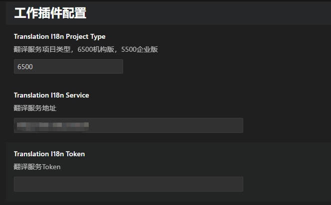

# VSCode 多语言翻译助手

该 VSCode 扩展提供了一套简单高效的多语言翻译工作流解决方案，帮助开发者快速处理国际化(i18n)相关工作。扩展结构清晰，代码注释完善，非常适合想要学习 VSCode 扩展开发的开发者。

## ✨ 功能特性

1. **快速添加翻译标记**
   - 选中代码文本
   - 自动在文本前后添加 `##` 标记

2. **一键翻译标记文本**
   - 自动检测文件中带有 `##` 标记的文本
   - 调用翻译 API 进行多语言转换

3. **多语言文件管理**
   - 一键下载多语言文件
   - 自动复制到指定目录

## 🚀 快速开始

1. 在 VSCode 中安装扩展
2. 打开需要处理多语言的文件
3. 使用以下功能：
   - 选中文本并使用快捷键 `Ctrl+3` 添加 ## 标记
   - 当前文件右键选择翻译多语言按钮进行翻译
   - 使用命令面板选择 "复制多语言文件"进行下载多语言


## 🔧 配置项

在 VSCode 设置中可以配置：
- 翻译服务地址
- 翻译服务Token
- 翻译服务项目类型，6500机构版，5500企业版

## 📖 扩展开发学习要点

本扩展涉及以下 VSCode 扩展开发知识点：

1. **基础概念**
   - 扩展激活事件
   - 命令注册与实现
   - 快捷键绑定

2. **核心 API 使用**
   - 文本选择与编辑
   - 文件系统操作
   - 配置管理

3. **进阶特性**
   - 左侧自定义视图的使用
   - API 调用集成
   - 错误处理


## 📝 源码结构

项目的主要源码组织如下：

```
src/
├── commands/              # 命令实现
│   ├── addHashTags.ts    # 添加 ## 标记
│   ├── translationI18n.ts # 翻译实现
│   └── copyI18n.ts       # 文件复制
│
├── class/                # 核心类
└── extension.ts          # 扩展入口

```

## ⚙️ 开发环境设置

1. 克隆仓库
\`\`\`bash
git clone https://github.com/oofengoo/vscode-extension-i18n-learn.git
\`\`\`

2. 安装依赖
\`\`\`bash
npm install
\`\`\`

3. 打开 VSCode 并启动调试
   - 按 F5 启动调试
   - 在新窗口中测试功能


如果这个扩展帮助到你，请给个 ⭐️Star 支持一下！